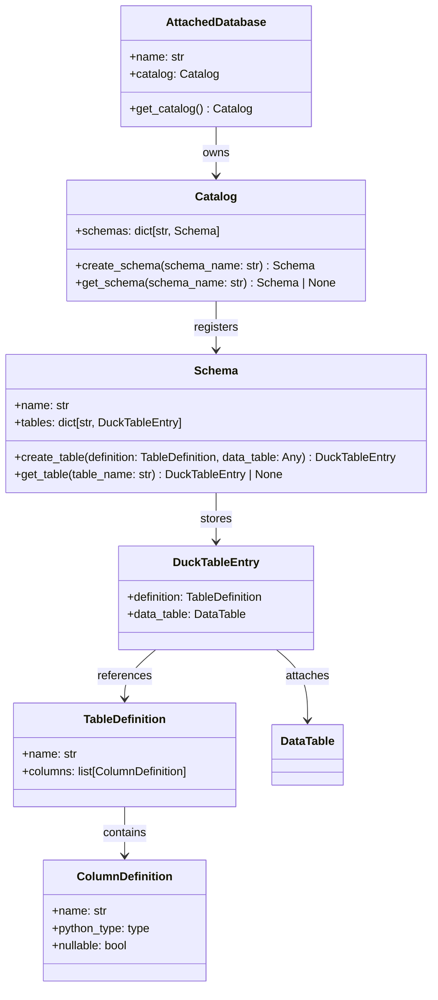
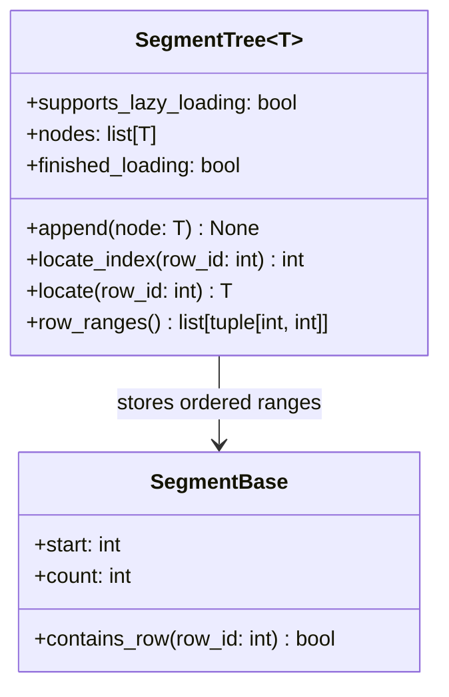

# Curriculum: Build a Mini Columnar Storage Engine in Python

This curriculum turns DuckDB-style table storage ideas into an iterative coding exercise.

## Learning outcomes

By the end of the exercise, the candidate should be able to:

1. model catalog objects that lead to physical table storage
2. build a segment tree for fast row-range lookup
3. represent statistics and block pointers as persistent metadata
4. pack column segments into fixed-size blocks
5. manage row groups and column-oriented storage
6. serialize checkpoint state from bottom-up
7. support deletes through version metadata
8. run an end-to-end demo with append, scan, checkpoint, and reload

---

## Question 1 - Catalog hierarchy

Implement the catalog path owned by `AttachedDatabase`: `AttachedDatabase -> Catalog -> Schema -> DuckTableEntry -> DataTable`.

### Top-level class diagram

### Goal
Expose the catalog from `AttachedDatabase`, create schemas in `Catalog`, and attach a `DataTable` to each `DuckTableEntry`.

### Guidance
- Make schema creation idempotent or raise a clear error.
- Validate duplicate table names.
- Keep the API small and explicit.

### Files
- `columnar_storage/catalog.py`
- `columnar_storage/database.py`

### Tests
- `tests/test_question_01_catalog.py`

---

## Question 2 - Segment tree lookup

Implement ordered segment registration and binary-search row lookup.

### Class diagram

### Goal
Allow fast resolution from a row id to the owning row group or column segment.

### Guidance
- Segments must remain sorted by `start`.
- `locate_index()` should use binary search.
- `locate()` should return the node, not just the index.

### Files
- `columnar_storage/segment_tree.py`

### Tests
- `tests/test_question_02_segment_tree.py`

---

## Question 3 - Statistics and pointers

Implement statistics merging and pointer serialization.

### Goal
Track segment-level and table-level metadata similarly to checkpoint state.

### Guidance
- Support `min`, `max`, `null_count`, and constant detection.
- Keep `to_dict()` and `from_dict()` symmetrical.

### Files
- `columnar_storage/stats.py`
- `columnar_storage/blocks.py`
- `columnar_storage/storage.py`

### Tests
- `tests/test_question_03_statistics_and_pointers.py`

---

## Question 4 - Block allocation

Implement fixed-size data blocks and partial block reuse.

### Goal
Persist segments into 256-KB blocks or pack smaller segments together.

### Guidance
- Reuse partially filled blocks before allocating a new one.
- Return a `BlockPointer` with `block_id` and `offset`.
- Track modified blocks for later cleanup or reuse.

### Files
- `columnar_storage/blocks.py`

### Tests
- `tests/test_question_04_blocks.py`

---

## Question 5 - Column segments

Implement a column segment that stores a bounded slice of values.

### Goal
Append values, estimate size, detect constant segments, and expose `DataPointer` metadata.

### Guidance
- A segment should own one contiguous row range.
- Constant segments should be representable without allocating a data block.

### Files
- `columnar_storage/storage.py`
- `columnar_storage/stats.py`

### Tests
- `tests/test_question_05_column_segments.py`

---

## Question 6 - Column data and row groups

Implement column-oriented append and scan inside a row group.

### Goal
Split rows by column, maintain one `ColumnData` per column, and reconstruct rows when scanning.

### Guidance
- A `RowGroup` stores all columns for one row range.
- Scans should respect deleted rows through `VersionInfo`.

### Files
- `columnar_storage/storage.py`

### Tests
- `tests/test_question_06_row_groups.py`

---

## Question 7 - Table append and scan

Implement the full table hierarchy with multiple row groups.

### Goal
Append rows across row groups and scan them back in row order.

### Guidance
- Create new row groups when the active one is full.
- Use the segment tree to locate row groups during scans.

### Files
- `columnar_storage/storage.py`
- `columnar_storage/catalog.py`

### Tests
- `tests/test_question_07_data_table.py`

---

## Question 8 - Checkpoint state flow

Implement bottom-up checkpoint state objects and metadata serialization.

### Goal
Make column segments emit `DataPointer` objects, make row groups emit `RowGroupPointer`, and make the table emit a final metadata payload.

### Guidance
- Keep the writer in-memory and deterministic.
- Separate table metadata from actual block data.
- Include delete/version metadata pointers.

### Files
- `columnar_storage/checkpoint.py`
- `columnar_storage/storage.py`

### Tests
- `tests/test_question_08_checkpoint.py`

---

## Question 9 - Database facade

Implement a small facade that wires together database, schema, and table operations.

### Goal
Expose high-level operations such as `create_table()`, `insert_rows()`, `scan_rows()`, and `checkpoint_table()`.

### Guidance
- Keep it thin. Most logic belongs in the storage classes.
- Return plain Python dictionaries for rows.

### Files
- `columnar_storage/database.py`

### Tests
- `tests/test_question_09_database_facade.py`

---

## Question 10 - Final integration demo

Make the demo script run without any `NotImplementedError`.

### Goal
Create a database, a schema, a table, append rows, delete one row, checkpoint metadata, and read rows back.

### Guidance
- The demo should show the four-level hierarchy in action.
- Print checkpoint metadata in a readable form.
- Keep the implementation educational rather than optimized.

### Files
- `main.py`

### Tests
- `tests/test_question_10_main_demo.py`

---

## Optional stretch goals

- add simple compression markers
- support validity columns explicitly instead of nullable Python values
- persist metadata to JSON files on disk
- reload a table from checkpoint metadata
- add list columns or nested types
