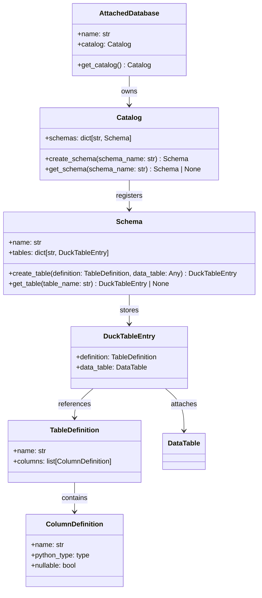
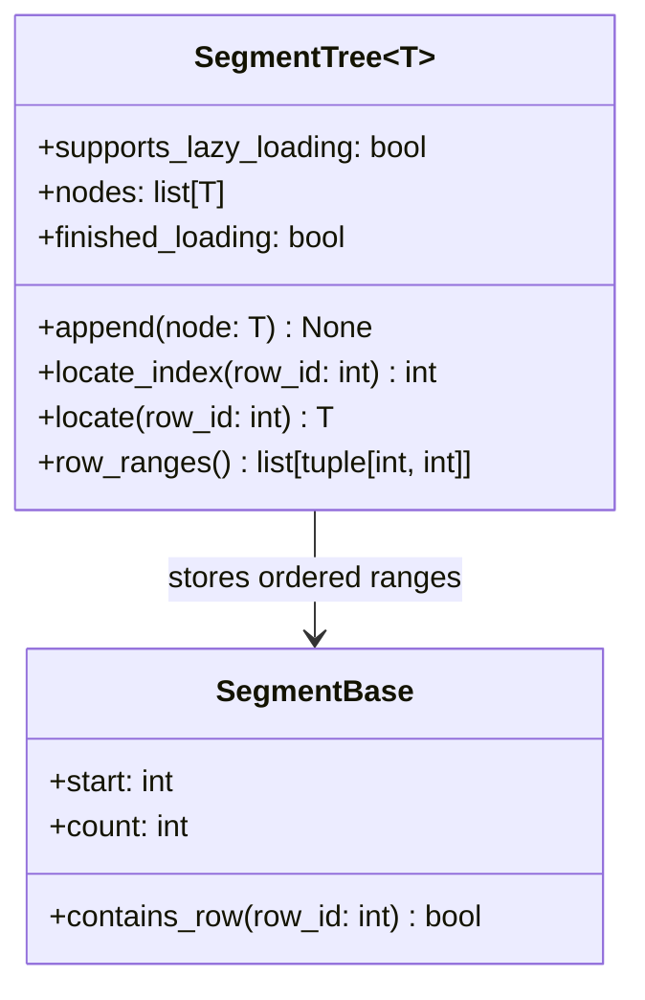
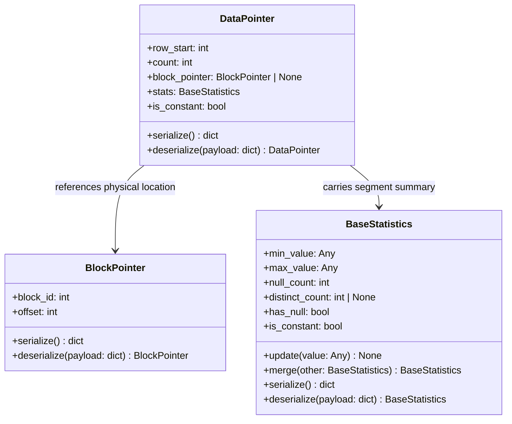
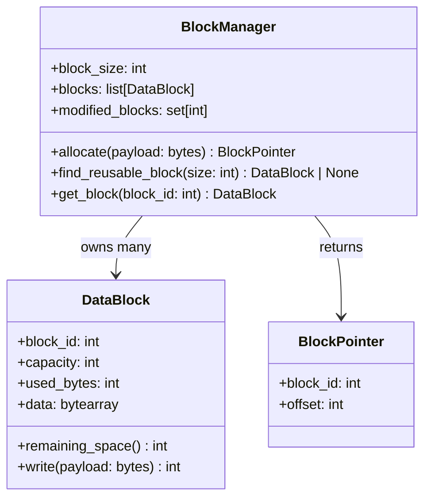
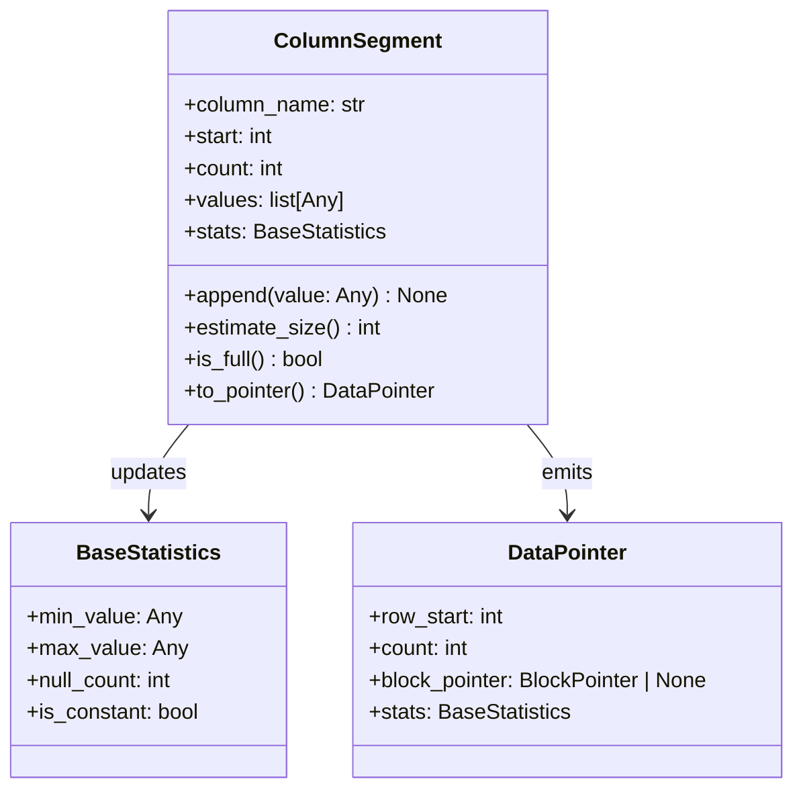
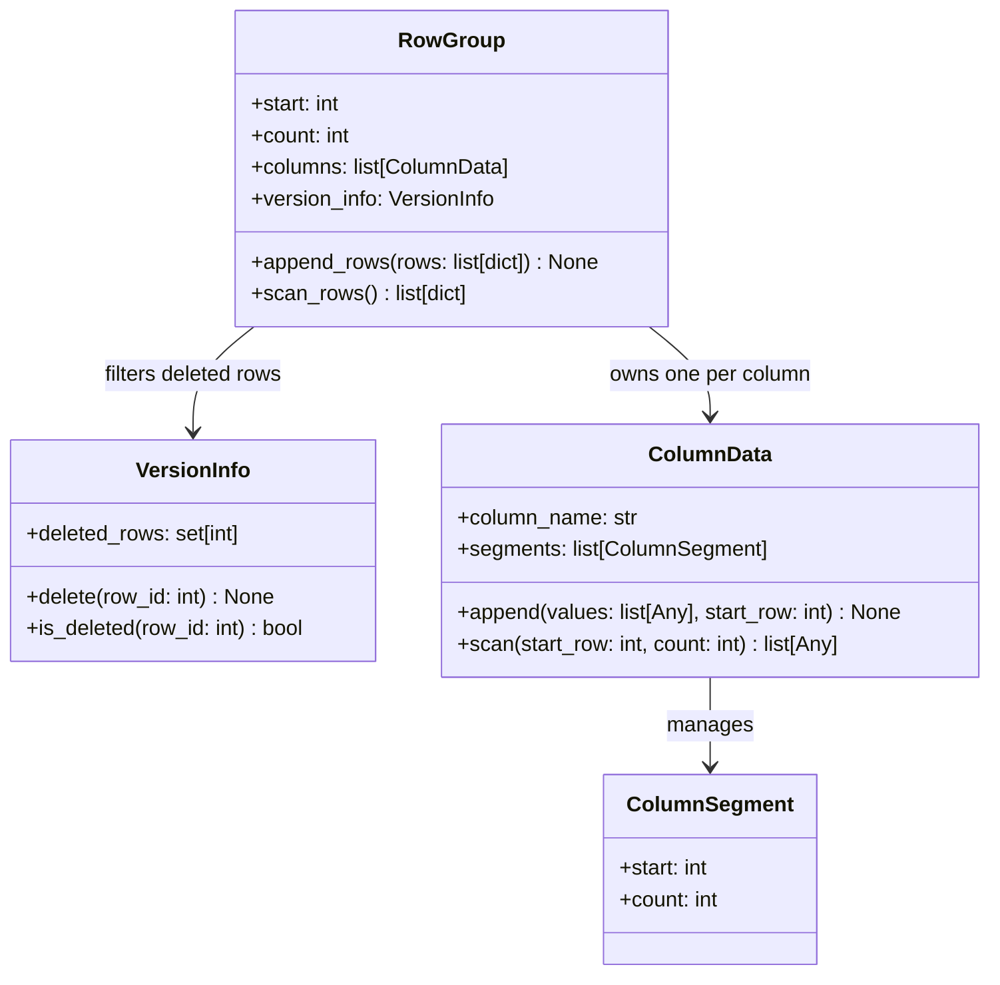
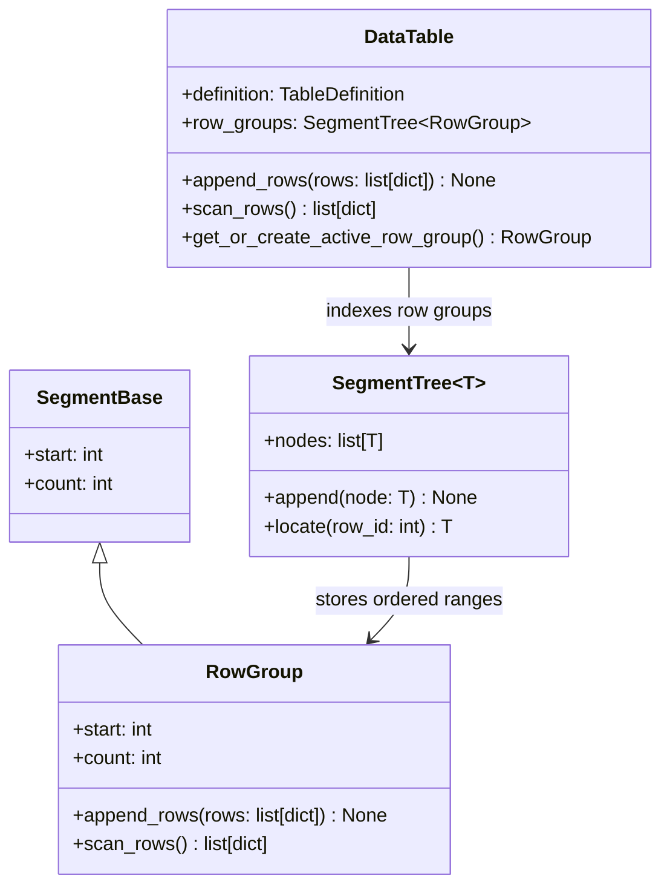
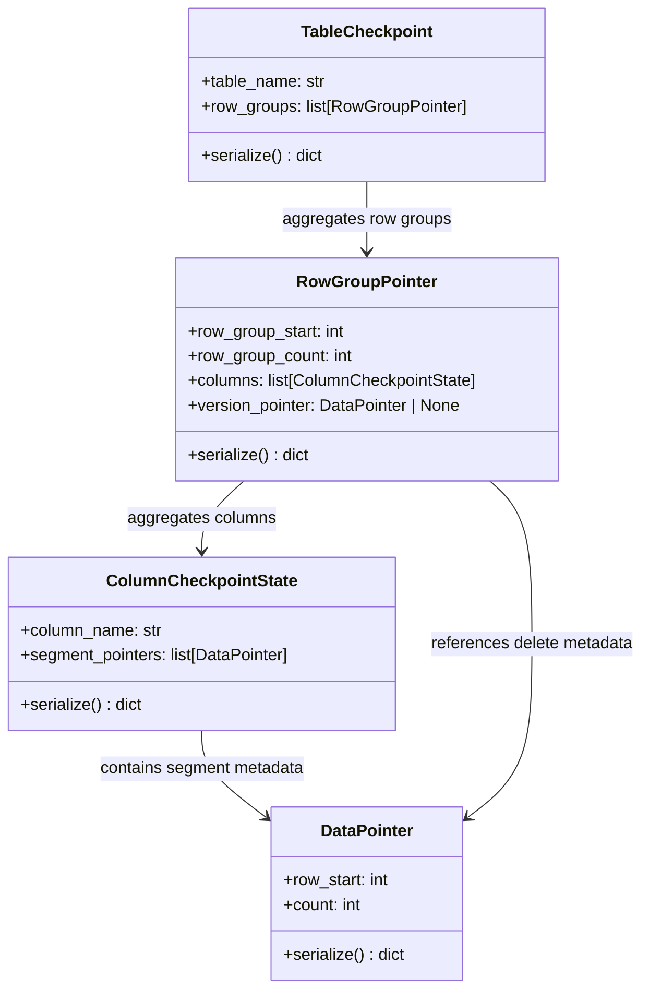
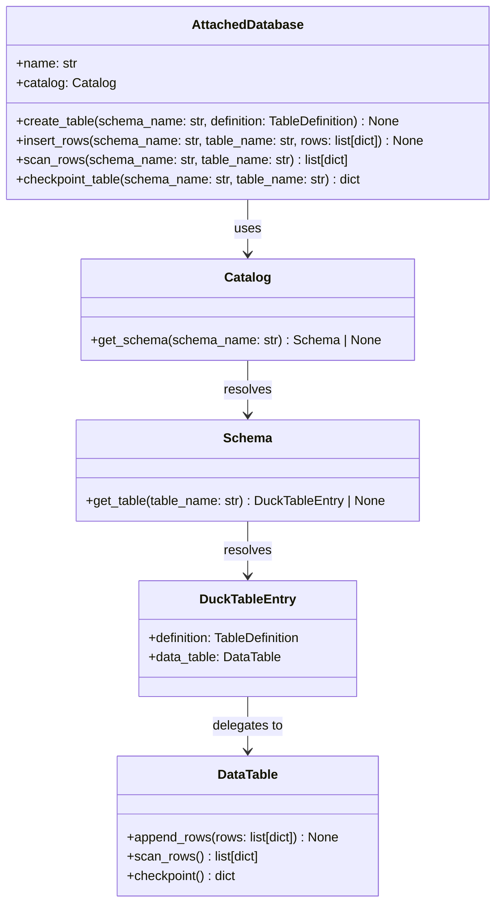
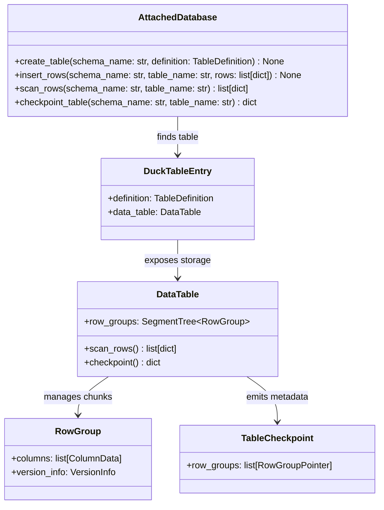

# Curriculum: Build a Mini Columnar Storage Engine in Python

This curriculum turns DuckDB-style table storage ideas into an iterative coding exercise.

## Why this exercise exists

Analytical databases do not store data the same way as a simple list of Python dictionaries or a row-oriented database. They usually split data by column, group rows into chunks, track metadata aggressively, and serialize that metadata so the system can quickly find, scan, and reload data later.

This project is meant to make those ideas concrete.

Instead of studying storage-engine concepts only in theory, you build them step by step:

- first the logical catalog that describes what exists
- then the physical structures that own data
- then the metadata that makes scans and checkpoints efficient
- and finally a thin database facade that ties the pieces together

Each question introduces one storage concept that real systems rely on. The point is not to build a production database. The point is to understand why these layers exist, how they depend on each other, and what problem each one solves.

## Learning outcomes

By the end of the exercise, the candidate should be able to:

1. model catalog objects that lead to physical table storage
2. build a segment tree for fast row-range lookup
3. represent statistics and block pointers as persistent metadata
4. pack column segments into fixed-size blocks
5. manage row groups and column-oriented storage
6. serialize checkpoint state from bottom-up
7. support deletes through version metadata
8. run an end-to-end demo with append, scan, checkpoint, and reload

---

## Question 1 - Catalog hierarchy

Implement the catalog path owned by `AttachedDatabase`: `AttachedDatabase -> Catalog -> Schema -> DuckTableEntry -> DataTable`.

### Why you are learning this

Before a database can store rows, it needs a logical namespace that answers basic questions: what schemas exist, what tables belong to them, and where the physical storage for a table lives. This is the boundary between metadata about a table and the actual data inside the table.

This question teaches the difference between:

- logical objects such as schemas and table definitions
- physical objects such as the `DataTable` that will eventually hold row groups and column segments

It also mirrors how real systems separate catalog management from storage management.

### Top-level class diagram

### Goal
Expose the catalog from `AttachedDatabase`, create schemas in `Catalog`, and attach a `DataTable` to each `DuckTableEntry`.

### Guidance
- Make schema creation idempotent or raise a clear error.
- Validate duplicate table names.
- Keep the API small and explicit.

### Files
- `columnar_storage/catalog.py`
- `columnar_storage/database.py`

### Tests
- `tests/test_question_01_catalog.py`

---

## Question 2 - Segment tree lookup

Implement ordered segment registration and binary-search row lookup.

### Why you are learning this

Large tables are broken into contiguous ranges of rows. Once data is chunked this way, the engine needs a fast way to answer: which chunk owns row id 42,000?

This question introduces the idea that storage structures are usually organized by row ranges, not by one giant monolithic array. A segment tree here is a lightweight index over ordered ranges. Learning this matters because many later objects, such as row groups and column segments, will rely on efficient range lookup instead of linear scans.

### Class diagram

### Goal
Allow fast resolution from a row id to the owning row group or column segment.

### Guidance
- Segments must remain sorted by `start`.
- `locate_index()` should use binary search.
- `locate()` should return the node, not just the index.

### Files
- `columnar_storage/segment_tree.py`

### Tests
- `tests/test_question_02_segment_tree.py`

---

## Question 3 - Statistics and pointers

Implement statistics merging and pointer serialization.

### Why you are learning this

Databases do not only store values. They also store metadata about values.

Statistics such as minimum, maximum, null counts, and constant detection let the engine summarize data without reading every value again. Pointer objects describe where serialized data lives, so metadata can refer to persisted blocks without embedding the raw bytes everywhere.

This question matters because it introduces two core storage-engine habits:

- summarize data early so later operations can make cheap decisions
- represent physical locations explicitly so state can be checkpointed and reloaded

### Class diagram

### Goal
Track segment-level and table-level metadata similarly to checkpoint state.

### Guidance
- Support `min`, `max`, `null_count`, and constant detection.
- Keep `serialize()` and `deserialize()` symmetrical.

### Files
- `columnar_storage/stats.py`
- `columnar_storage/blocks.py`
- `columnar_storage/storage.py`

### Tests
- `tests/test_question_03_statistics_and_pointers.py`

---

## Question 4 - Block allocation

Implement fixed-size data blocks and partial block reuse.

### Why you are learning this

Storage engines rarely allocate one file object per value or even per segment. They typically write into fixed-size blocks or pages. That keeps storage predictable, reduces fragmentation, and makes metadata simpler.

This question teaches why block managers exist at all:

- to pack bytes into reusable fixed-size units
- to avoid wasting space when a segment is smaller than a full block
- to produce stable block references that higher layers can store as metadata

Once you understand block allocation, later checkpoint objects make much more sense because they point to blocks rather than to Python objects in memory.

### Class diagram

### Goal
Persist segments into 256-KB blocks or pack smaller segments together.

### Guidance
- Reuse partially filled blocks before allocating a new one.
- Return a `BlockPointer` with `block_id` and `offset`.
- Track modified blocks for later cleanup or reuse.

### Files
- `columnar_storage/blocks.py`

### Tests
- `tests/test_question_04_blocks.py`

---

## Question 5 - Column segments

Implement a column segment that stores a bounded slice of values.

### Why you are learning this

Columnar systems physically separate each column, then break each column into manageable pieces. A column segment is one of those pieces.

This question shows why that design is useful:

- a segment owns one contiguous row range, so it is easy to reason about
- segment-local statistics can describe a small slice accurately
- constant or tiny segments can be optimized differently from general segments

In other words, this is where the abstract idea of “columnar storage” becomes a real in-memory structure with a start row, a bounded size, and checkpoint metadata.

### Class diagram

### Goal
Append values, estimate size, detect constant segments, and expose `DataPointer` metadata.

### Guidance
- A segment should own one contiguous row range.
- Constant segments should be representable without allocating a data block.

### Files
- `columnar_storage/storage.py`
- `columnar_storage/stats.py`

### Tests
- `tests/test_question_05_column_segments.py`

---

## Question 6 - Column data and row groups

Implement column-oriented append and scan inside a row group.

### Why you are learning this

A row group is the unit that keeps several column segments aligned over the same row range. This is one of the most important ideas in analytical storage: data is split by column, but the system still needs a way to reconstruct full rows when scanning.

This question teaches the tradeoff directly:

- storage is column-oriented for organization and metadata
- reads may still need to rebuild row-shaped results for users
- delete tracking must remain aligned with the same row positions

By implementing scans through a row group, you learn how a database can be columnar internally but still present row-like output externally.

### Class diagram

### Goal
Split rows by column, maintain one `ColumnData` per column, and reconstruct rows when scanning.

### Guidance
- A `RowGroup` stores all columns for one row range.
- Scans should respect deleted rows through `VersionInfo`.

### Files
- `columnar_storage/storage.py`

### Tests
- `tests/test_question_06_row_groups.py`

---

## Question 7 - Table append and scan

Implement the full table hierarchy with multiple row groups.

### Why you are learning this

One row group is not enough for a growing table. Real tables are made of many chunks, and the table object is responsible for routing appends to the active chunk and scans across all chunks in row order.

This question matters because it connects local storage objects to table-scale behavior:

- row groups become the repeating storage unit
- the table decides when to open a new row group
- the segment tree becomes useful as the lookup structure over row groups

At this stage, the project starts to resemble a real storage hierarchy instead of a collection of isolated classes.

### Class diagram

### Goal
Append rows across row groups and scan them back in row order.

### Guidance
- Create new row groups when the active one is full.
- Use the segment tree to locate row groups during scans.

### Files
- `columnar_storage/storage.py`
- `columnar_storage/catalog.py`

### Tests
- `tests/test_question_07_data_table.py`

---

## Question 8 - Checkpoint state flow

Implement bottom-up checkpoint state objects and metadata serialization.

### Why you are learning this

In-memory structures are not enough if the system cannot describe its state in a durable, serializable form. Checkpointing is the bridge from live objects to persistent metadata.

This question is important because it teaches bottom-up serialization:

- column segments emit pointers to persisted data
- row groups aggregate segment metadata
- the table aggregates row-group metadata into one checkpoint payload

That bottom-up flow is a common systems pattern. Lower layers know the physical details; higher layers only assemble references and summaries.

### Class diagram

### Goal
Make column segments emit `DataPointer` objects, make row groups emit `RowGroupPointer`, and make the table emit a final metadata payload.

### Guidance
- Keep the writer in-memory and deterministic.
- Separate table metadata from actual block data.
- Include delete/version metadata pointers.

### Files
- `columnar_storage/checkpoint.py`
- `columnar_storage/storage.py`

### Tests
- `tests/test_question_08_checkpoint.py`

---

## Question 9 - Database facade

Implement a small facade that wires together database, schema, and table operations.

### Why you are learning this

Most users should not need to know the internal storage hierarchy just to create a table or insert rows. A facade gives the system a small public surface while preserving the richer internal design underneath.

This question teaches API layering:

- internal classes can stay focused on storage responsibilities
- the database object can offer simple task-oriented operations
- callers get plain Python data structures instead of storage internals

Learning this matters because good systems design is not only about building internals. It is also about exposing the right abstraction boundary.

### Class diagram

### Goal
Expose high-level operations such as `create_table()`, `insert_rows()`, `scan_rows()`, and `checkpoint_table()`.

### Guidance
- Keep it thin. Most logic belongs in the storage classes.
- Return plain Python dictionaries for rows.

### Files
- `columnar_storage/database.py`

### Tests
- `tests/test_question_09_database_facade.py`

---

## Question 10 - Final integration demo

Make the demo script run without any `NotImplementedError`.

### Why you are learning this

The final demo forces all layers to work together as one system rather than as individually passing test targets.

This step matters because integration reveals whether you truly built:

- a catalog that can find tables
- a table that can append and scan through row groups
- metadata objects that can describe persisted state
- version information that can hide deleted rows

It also gives you a narrative mental model of the engine: create database, create schema, create table, append rows, delete, checkpoint, reload metadata, and scan results. That story is often more valuable for learning than any single class implementation.

### Class diagram

### Goal
Create a database, a schema, a table, append rows, delete one row, checkpoint metadata, and read rows back.

### Guidance
- The demo should show the four-level hierarchy in action.
- Print checkpoint metadata in a readable form.
- Keep the implementation educational rather than optimized.

### Files
- `main.py`

### Tests
- `tests/test_question_10_main_demo.py`

---

## Optional stretch goals

These are intentionally beyond the core exercise. They point toward the next questions a real storage engine must answer once the basic design works.

- add simple compression markers
- support validity columns explicitly instead of nullable Python values
- persist metadata to JSON files on disk
- reload a table from checkpoint metadata
- add list columns or nested types
